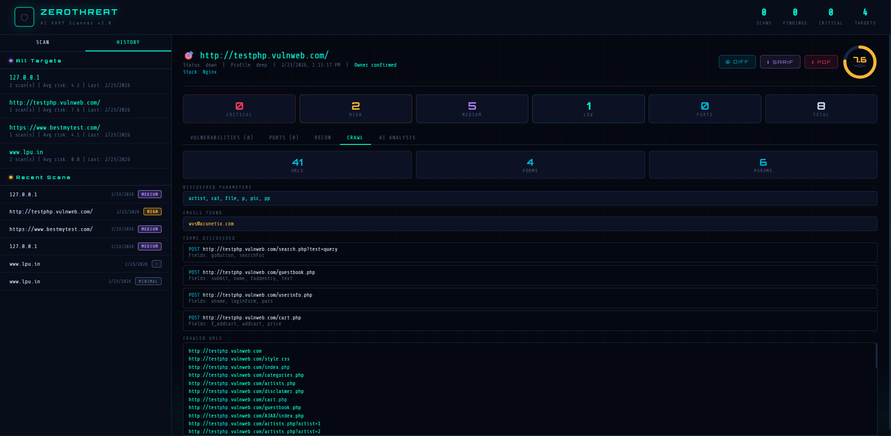

# 🔥 ZeroThreat AI VAPT Scanner v3.0

Advanced **Vulnerability Assessment & Penetration Testing (VAPT)** Scanner built using pure Python.

ZeroThreat is a lightweight security scanner designed for educational and authorized security testing.  
It combines **network scanning**, **web vulnerability detection**, **AI-based risk scoring**, and a modern dashboard interface — all without heavy dependencies.

> ⚠️ **For educational and authorized testing ONLY.**  
> Never scan systems you do not own or have explicit permission to test.

---

## 🚀 Features

### 🔎 Network Security Scanning
- Multi-threaded TCP port scanning
- Service fingerprinting & banner grabbing
- Detection of common service misconfigurations
- Exposure checks (Telnet, FTP, SMB, RDP, etc.)
- Confidence-based fingerprint scoring

### 🌐 Web Application Scanning
- XSS detection (basic reflected checks)
- SQL Injection error detection
- Open Redirect checks
- Sensitive file discovery (`.env`, `.git`, backups)
- Admin panel discovery
- Directory listing detection
- Security headers analysis
- Weak CORS detection
- SSL/TLS inspection

### 🤖 AI Risk Analysis
- Risk score (0–10)
- Severity breakdown
- Attack chain suggestions
- Prioritized remediation advice

### 📊 Web Dashboard
- Real-time scan progress
- Scan history
- Risk score visualization
- Vulnerability cards
- Port/service tables
- AI analysis output

### 📁 Reports & Exports
- PDF report generation
- SARIF 2.1.0 export (CI/CD compatible)
- Scan history storage (SQLite)
- Scan diff comparison

### 🔌 Plugin System
Add new checks easily:

```
checks/network/*.py
checks/web/*.py
```

---

## 🧱 Project Structure

```
zerothreat/
│
├── api_server.py          # HTTP server & REST API
├── scanner_core.py        # Main scanning engine
├── dashboard.html         # Web dashboard UI
├── history_store.py       # SQLite history database
├── pdf_report.py          # PDF report generator
│
├── checks/
│   ├── network/
│   │   └── memcached_udp.py
│   └── web/
│       └── default_credentials.py
│
├── zerothreat_history.db  # Scan history database (local only - do not upload)
└── README.md
```

---

## 🧩 Requirements

- Python 3.8+
- reportlab (for PDF reports)

Install dependencies:

```bash
pip install reportlab
```

---

## ▶️ Running the Project

### Start Dashboard Server

```bash
cd files
python api_server.py
```

Open browser:

```
http://localhost:8080
```

---

## 🧪 Example Scans

### Dashboard Scan
Use the web UI to start scans.

### CLI Scan (if enabled)

```bash
python scanner_core.py scanme.nmap.org both
python scanner_core.py 192.168.1.1 network
python scanner_core.py https://example.com webapp
```

---

## 📡 API Endpoints

| Method | Endpoint | Description |
|---|---|---|
| GET | `/` | Dashboard |
| POST | `/api/scan` | Start scan |
| GET | `/api/status?job_id=X` | Scan progress |
| GET | `/api/jobs` | Active jobs |
| GET | `/api/history` | Scan history |
| GET | `/api/report/pdf` | Download PDF report |
| GET | `/api/report/sarif` | Download SARIF report |
| POST | `/api/diff` | Compare scans |

---

## 📈 Scan Profiles

- **Light** → Fast scan, minimal checks
- **Normal** → Balanced (recommended)
- **Deep** → Aggressive scanning

---

## 🧠 Architecture

```
Dashboard UI
      ↓
API Server (HTTP)
      ↓
Scanner Core
      ↓
Network + Web Analysis
      ↓
AI Risk Engine
      ↓
Reports + History Storage
```

---

## 🛡️ Safety Features

- Private IP detection
- Owner confirmation option
- Passive-only scanning mode
- Rate limiting
- Scope control

---

## 📷 Screenshots


Example:

## 📸 Dashboard Demo

<p align="center">
  
</p>

---

## 🔮 Future Improvements

- CVE database integration
- Subdomain enumeration
- CIDR network scans
- Authentication-based scans
- Scheduled scans
- Advanced crawling engine

---

## 👨‍💻 Author

**Anuj Kumar**  
BCA (Cyber Security) Student  
Built for learning & practical cybersecurity experience.

---

## ⭐ Disclaimer

This tool is created strictly for **educational purposes**.

The author is **not responsible** for misuse or unauthorized scanning.

Always get proper permission before testing any system.
